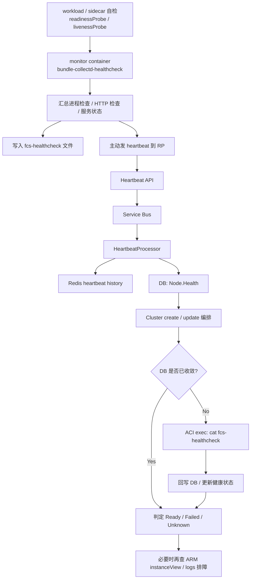

# 项目专题面试题

> 结合 Microsoft FCS / Scout / Hilo 项目经验的实战问答，含架构设计、技术选型与难点拆解。

---

## Hilo

### Polling CR status 还是 Watch？一次 Hilo 的技术选型 trade-off

**题目背景：** 在 Hilo 里，控制面通过 K8s API 写入 Cluster CR，集群内 operator watch 这个 CR，再去创建真实的 Pod、Service 等资源。控制面需要判断这次 rollout 什么时候真正完成。

**核心回答：** 我会把它讲成一个**控制面等待数据面收敛**的技术选型问题，而不是单纯讨论“轮询高级还是 Watch 高级”。  
这类场景常见有三种思路：**Polling CR status、Watch 事件驱动、operator 主动回调控制面**。我的判断标准不是谁最酷，而是谁在 **恢复语义、耦合度、失败处理、工程复杂度** 上最适合 Hilo 当时的架构。

#### 三种方案怎么比较

| 方案 | 优点 | 代价 / 风险 |
| --- | --- | --- |
| **Polling CR status** | 模型简单、终态清晰、恢复性好、和 operator 解耦 | 有无效轮询，时延和 API QPS 不够优雅 |
| **Watch 事件驱动** | 延迟更低、减少无效查询 | 事件丢失、重连、bookmark、状态恢复更复杂 |
| **operator 主动回调控制面** | 表面上最“实时” | 控制面和 operator 强耦合，多一条回调链路，多一层鉴权和运维复杂度 |

#### 为什么最终偏向 Polling

- 控制面只依赖 Kubernetes 最终状态，依赖边界更清晰。  
- operator 不需要额外对外回调，链路更短，故障面更小。  
- 控制面重启、Activity 重试后，可以继续从 CR status 恢复判断。  
- 超时、失败、卡住的语义容易统一收敛到编排层。

#### 一句话总结

> 这不是“Polling 落后、Watch 先进”的问题，而是**恢复语义、耦合度和工程复杂度**的权衡；在 Hilo 当时的架构下，Polling 是更稳的方案。

---

## Scout

### 这个项目一句话怎么介绍？

**答：** Scout 是一个面向 Azure Data / Spark 生产问题排障的智能体平台。  
它的核心不是通用问答，而是把专家排障方法论、领域知识和 Kusto 调查流程沉淀成可复用的智能体能力，帮助工程师更快定位根因。

### persona 可以怎么理解？

**答：** 在 Scout 里，persona 更适合翻译成 **专家角色**。  
它不是单纯的 skill，而是定义了智能体以什么身份、什么方法论去分析问题；skill 更偏单点能力，persona 更偏专家视角和调查策略。

### 整体架构怎么讲？

**答：** 我会概括成五层：**接入层、MCP 服务层、Persona 编排层、Knowledge 层、数据执行层**。

1. **接入层**：VS Code Agent / 本地扩展作为入口。  
2. **MCP 服务层**：`main.py` 启动 Python MCP Server，对外暴露 tools、resources、resource templates。  
3. **Persona 编排层**：`Personas/*.md` 定义不同排障专家角色，比如 JobService、Reliability。  
4. **Knowledge 层**：`Resources/` 和 `Analyzers/` 存放 schema、TSG、调查模式。  
5. **数据执行层**：外部 Kusto MCP / Fabric RTI MCP 负责真实查询，Scout 负责“怎么查”和“怎么分析”。

### LLM 什么时候知道该调用哪个 MCP？

**答：** 不是 Scout 内部硬编码决定的，而是 **MCP host 初始化时做能力发现**。

- 宿主先连接各个 MCP server  
- 调用每个 server 的 `list_tools()` / `list_resources()`  
- 把这些 tool 描述统一提供给当前 LLM  
- LLM 再根据用户问题语义决定先调 Scout，还是直接调 Kusto MCP

所以可以理解成：

- **Scout**：提供专家调查方法和知识增强  
- **Kusto MCP**：提供真实数据查询能力  
- **LLM + Host**：负责工具选择和调用路由

### 这个项目的亮点是什么？

**答：** 我会强调四点：

1. **不是通用聊天，而是生产排障智能体**。  
2. **Persona 数据驱动**，新增专家角色主要靠加 markdown，不用频繁改主逻辑。  
3. **知识自动注入**，persona 引用 resource 后会自动加载 schema / analyzer / TSG。  
4. **工程化完整**，包含参数校验、路径安全、缓存、线程安全、日志和测试。

### 难点在哪里？

**答：**

1. **把隐性专家经验产品化**：把资深同学脑中的排障经验拆成 persona、resource、analyzer。  
2. **控制上下文和准确性**：知识不能一股脑全塞给模型，需要按场景精确注入。  
3. **兼顾灵活性和稳定性**：既要让 Agent 会调查，又要保证参数安全、资源安全和可恢复性。  
4. **多集群、多数据源一致性**：要让不同环境下的调查流程和口径保持一致。

### 如果今天重做，你会怎么设计？

**答：** 我会保留“专家角色 + 领域知识 + 调查流程”这三个核心思想，但不会再以 MCP 作为架构中心，而是升级成一个 **生产排障 Agent 平台**。

核心改动有三点：

1. **从协议驱动改成编排驱动**：引入 Orchestrator，负责意图识别、流程编排、证据汇总。  
2. **从 markdown persona 改成可执行策略**：把 persona 升级成带触发条件、调查 DAG、停止条件的策略。  
3. **从资源拼接改成知识检索和证据链**：把 TSG、schema、Analyzer 做成结构化知识层，按需召回，并输出可验证的 evidence chain。

一句话总结：

> 老的 Scout 更像“把 persona 暴露成 MCP tool”；新的 Scout 应该是“把排障流程做成可观测、可评估、可编排的智能调查系统”。

### 结合当前 AI 技术趋势，这个工具今天会怎么设计？

**答：** 如果按现在的技术趋势重做，Scout 不应该只停留在 **LLM + MCP**，而应该升级成一个 **生产排障 Agent 平台**：  
**`LLM + Orchestrator + Domain Tools + Retrieval/Memory + Eval/Observability + Guardrails`**。  
MCP 仍然可以保留，但更适合作为工具接入协议，而不是架构核心。

#### 我会强调三点升级

1. **从自由 tool-calling 升级成编排驱动**  
   增加 Orchestrator，负责问题分类、调查策略选择、步骤控制、证据汇总，而不是让 LLM 自己随意调工具。

2. **从 prompt persona 升级成可执行策略**  
   persona 不再只是专家说明书，而是带触发条件、调查 DAG、停止条件、人工升级条件的 Investigation Policy。

3. **从资源拼接升级成 agentic retrieval + memory**  
   不再把 schema / TSG / analyzer 全量拼进上下文，而是建立 Knowledge Service，按步骤动态检索，并结合历史 case 做长期记忆。

#### 工具层也要升级

我会尽量让模型调用 **领域 API**，而不是直接写底层 KQL，比如：

- `get_job_lifecycle(...)`
- `find_scheduler_blockers(...)`
- `get_cluster_health(...)`

这样比直接暴露原始查询工具更稳定、更安全，也更方便做权限控制、审计和评测。

#### 输出方式也要变

新版 Scout 不应该只输出自然语言结论，而应该输出：

- **root cause**
- **confidence（基于数据完整性、工具成功率、证据一致性校准，而不是模型自报分数）**
- **evidence chain**
- **recommended actions**
- **是否需要人工升级**

其中「是否需要人工升级」也不应该只看一个阈值，而要结合关键工具是否失败、证据是否冲突、根因是否收敛等策略条件来决定。

这样它才是一个真正可落地的生产排障系统，而不是“会回答问题的聊天助手”。

#### 一句话总结

> 现在的趋势不是“让模型会调更多工具”，而是“让 Agent 在受控编排、知识检索、证据链和评测体系下稳定地完成复杂任务”。Scout 如果今天重做，核心会从 MCP tool 暴露，升级成可编排、可观测、可评估的智能排障平台。

---

## FCS

### 技术难点 1：Cluster Health 技术实现

#### 核心结论

**答：** 因为 FCS 要判断的不是“某个容器 probe 是否通过”，而是 **整个 container group / node 能不能被平台视为 Ready**。  
ACI 的 `readinessProbe` 解决的是 workload 局部健康问题；FCS 的 ClusterHealth 解决的是平台级 readiness gate，需要统一收敛成自己的 `NodeHealthState`，并支撑编排、扩缩容、发布治理和故障恢复。

#### 为什么不直接用 ACI readinessProbe

| 原因 | 解释 |
| --- | --- |
| **判定对象不同** | ACI readiness 更偏单容器是否可接流量；FCS 要的是整个 container group / node 是否 ready。 |
| **需要统一平台状态** | FCS 后续流程依赖 DB 里的 `Node.Health`，所以必须统一映射成 `Ready / Failed / Unknown`。 |
| **需要组合判断** | 除了应用 HTTP probe，还要看 sidecar、collectd、fluent-bit、heartbeat、服务状态等多种信号。 |
| **要和编排闭环打通** | readiness 结果要参与 cluster 创建完成判定、超时失败、后续排障和 auto healing。 |

#### 实现通路怎么讲



#### 面试时推荐回答

**提问：** Cluster Health 这套技术实现是怎么做的？

**回答：**  
因为 ACI readinessProbe 只能说明单个容器局部是否 ready，但 FCS 需要的是平台级的 cluster/node readiness。  
所以我们没有直接拿 ACI probe 做最终判定，而是自己做了一层 ClusterHealth：在集群里放一个 monitor container，汇总应用探针、进程和 sidecar 状态，再主动上报 heartbeat 到 RP。RP 侧把 heartbeat 经过 Service Bus、Redis、DB 收敛成 `Node.Health`，编排层再以 DB 为第一信号源判断 cluster 是否 ready。  
如果 DB 没及时收敛，再 fallback 到 ACI 里 exec health monitor command 直接查健康文件。这样既保留了 workload 自检能力，又让平台有统一的 readiness 语义和恢复能力。

#### 一句话总结

> FCS 不是不用 readiness，而是**没有把 ACI 原生 readinessProbe 当成最终真相**；它在上层又做了一套 **monitor + heartbeat + DB NodeHealth + exec fallback** 的平台级 ClusterHealth 模型。

### 技术难点 2：工作流引擎的“执行唯一性”保障

**Q：FCS 里你觉得最有挑战性的技术难点是什么？**

**答：** 我会说是**工作流引擎的“执行唯一性”保障**，这个问题分两层，框架层和业务层，缺一不可。

#### 背景

FCS 使用 DurableTask Framework（DTF）做工作流编排，每个 Worker 负责若干个 Partition（控制队列）。  
我们按 Worker 数量配置 Partition 数量，正常情况下一个 Worker 持有一个 Partition。  
问题是：**Worker 会挂、会扩容**，这时候同一个 Orchestration（工作流实例）可能被多个 Worker 捡到，执行重复副作用。

#### 第一层：框架层 — Azure Blob Lease 保证“谁来调度”

**Azure Blob Lease 是什么：**  
Blob Lease 是 Azure Storage 原生提供的分布式互斥锁能力。  
对一个 Blob 对象申请租约后，同一时刻只有一个持有者；持有者必须在 TTL 到期前续租（默认 15 秒，每 10 秒续一次），如果 Worker 宕机停止续租，TTL 到期后锁自动释放，其他 Worker 可以竞争接管。  
这个能力由 Azure Storage 在存储层保证，不依赖外部协调服务。

**DTF 怎么用 Blob Lease：**

DTF 的 `SafePartitionManager` 把每个 Partition 绑定到一个 Blob 上，Worker 持有 Blob Lease 才能消费对应的控制队列。

- **Worker 宕机**：续租中断 → Lease 约 15 秒后自动过期 → 其他 Worker 竞争 Lease 接管该 Partition
- **扩容**：`LeaseCollectionBalancer` 检测到 Lease 分布不均 → 触发 Rebalance → 新 Worker 抢占多余 Partition → 原持有者收到 `LeaseLostException` → 立即停止消费

**结论：** 框架层通过 Blob Lease 保证同一时刻一个 Partition 只有一个 Worker 在调度，解决了“谁来执行”的互斥问题。

#### 第二层：业务层 — 幂等设计防止“副作用重复产生”

框架保证的是“最多一个 Worker 持有 Partition”，但 DTF 是 at-least-once 语义：  
Activity 可能在崩溃、重试、Replay 过程中被多次触发，真正的业务逻辑（比如创建 AKS 节点、调用外部 API）必须自己保证幂等。

**我们的三级防护：**

```csharp
// ① Check-then-Act + OrchestrationInstanceId 作为幂等键
var existing = await db.GetByIdempotencyKey(ctx.OrchestrationInstance.InstanceId);
if (existing != null) return existing;
return await downstream.CreateResource(req, idempotencyKey: instanceId);

// ② DB 唯一约束兜底（Check-then-Act 有竞态窗口时触发）
// UNIQUE INDEX (orchestration_instance_id, resource_type)
// catch DuplicateKeyException → 当作幂等成功处理

// ③ Redis 分布式锁（对不支持幂等键的外部 API 按需加）
await using var _ = await redisLock.AcquireAsync(lockKey, ttl: 60s);
```

#### 一句话收尾

> 框架层（Blob Lease）防“谁来调度”，业务层（幂等三级防护）防“副作用被重复产生”；两层缺一不可，这才是 FCS 工作流可靠性的完整答案。

### 技术难点 3：记一次分页故障

#### 背景

这是一次很典型的 **基础设施变更触发应用链路故障**。  
当时我们把 Cosmos DB 里几个高流量容器（`Nodes` / `Clusters` / `ClusterPools`）的 RU 上限从 **10k 提到 15k**。扩容后，Cosmos DB 在底层新增了 **physical partition**，数据发生了重新分布。

这个变化把一个原本被掩盖的问题暴露出来：`ListNodes` 按设计本来应该是 **single-partition query**，但实现上实际上还是 **cross-partition query**。

#### 故障现象

扩容后，`ListNodes` 出现了一个很隐蔽的分页边界情况：

- **当前页为空**
- **但 continuation token 非空**

我们的查询逻辑看到这一页没数据，就直接返回给上游，没有继续消费 continuation token。  
于是上游把这个结果误判成“**没有节点**”。

这个错误结果继续往上游传导：

1. `ListNodes` 错误返回空结果  
2. `TokenService` 误判 FCS Cluster Node IP 校验失败  
3. `Pubsub agent -> Pubsub service` 调用全部失败  
4. 最终影响 **所有 PYNB session startup**

#### 技术难点

真正难的地方不是接口报错，而是它表面上 **返回成功**，只是**语义错了**。  
从现象上看，问题暴露在 session startup failure；但真正根因需要一层层往下追：

- 从上游 session 启动失败，追到 `TokenService`
- 再追到 `ListNodes`
- 最后追到底层 Cosmos DB 的分页行为，以及扩容后 **physical partition** 变化

这个故障的本质，是两个隐藏假设同时被打破了：

1. **误把 cross-partition query 当成稳定的 single-partition query 在用**  
2. **误把 empty page 当成 query finished，没有结合 continuation token 一起判断**

#### 修复思路

#### 1. 短期止血

先修正底层分页逻辑：**只要 continuation token 还存在，就必须继续翻页**，不能因为当前页为空就提前返回。  
这个修复对应 **2025-06-17 commit `26997ddc0`**。

#### 2. 长期治理

把 `ListNodes` 改成真正的 **partition-scoped query**，避免 cross-partition query 带来的正确性风险和性能风险。

#### 面试时怎么讲亮点

这个案例不是普通的分页 bug，而是一个 **容量扩展触发的分布式系统边界问题**。

扩容本身没有错，但它改变了底层 **physical partition** 分布，暴露了应用层对查询行为的错误假设。  
这个故事能体现三点：

1. **你理解数据库分区模型，而不只是会用 SDK**  
2. **你知道分页语义不能只看“当前页有没有数据”，还要结合 continuation token**  
3. **你能从链路级故障现象，一层层定位到存储层根因**

#### 可能的 follow-up 问题

**Q：你刚才提到 RU 扩容和 physical partition 变化，能解释一下 logical partition、physical partition、cross-partition query 之间的关系吗？**

**答：**  
Cosmos DB 对业务暴露的是 **logical partition**，由 partition key 决定；底层真正承载吞吐和数据的是 **physical partition**。  
当 RU 扩容到一定规模后，Cosmos DB 可能新增 physical partition，并把一部分 logical partitions 重新映射过去。

如果查询被 partition key 精确限定，那它就是 **single-partition query**；如果没有限定，就会变成 **cross-partition query**，需要跨多个 physical partitions 聚合结果。  
这样在扩容或数据重分布后，就更容易暴露出分页、部分结果、`empty page + non-empty token` 这类边界情况。

#### 一句话总结

> 这次事故的关键经验不是“修了一个分页 bug”，而是**不能依赖某个规模下看起来没问题的 cross-partition query 行为**；应该从设计上把查询收敛到正确的 partition scope。
