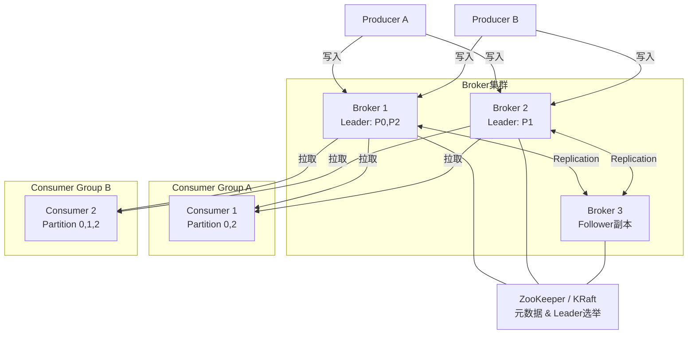
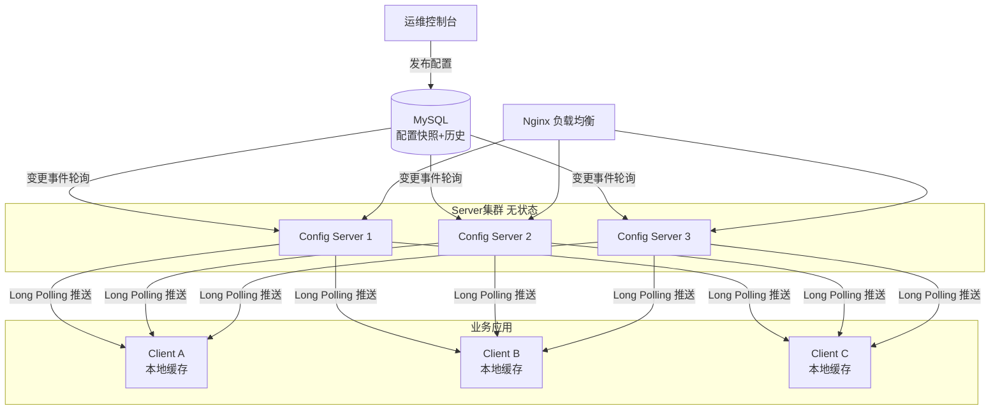
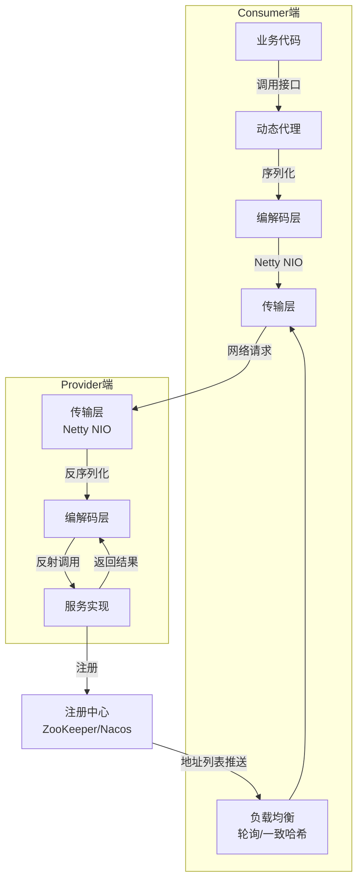
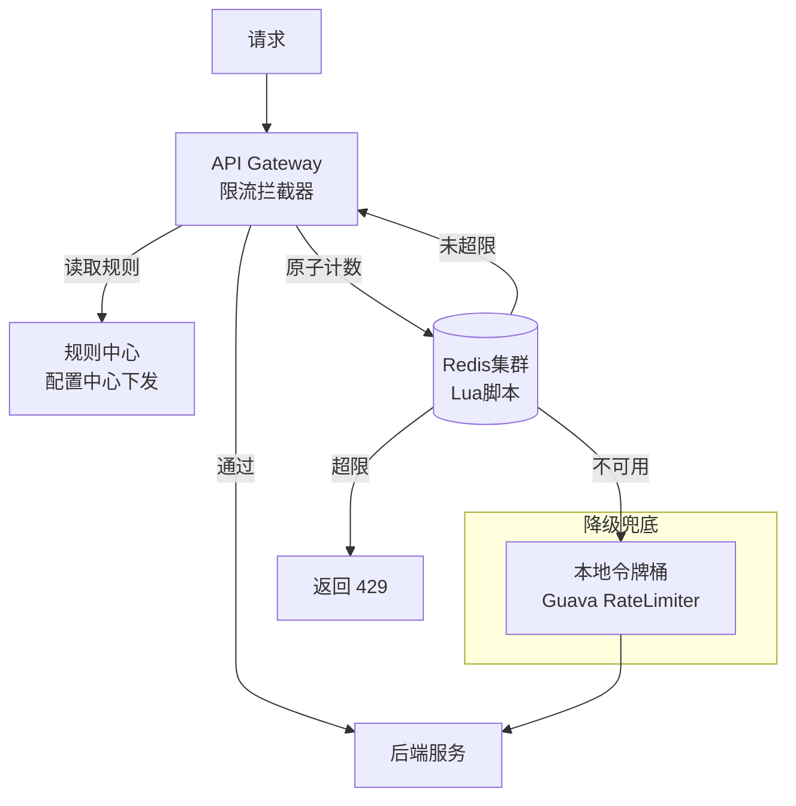
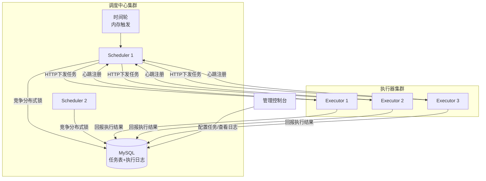
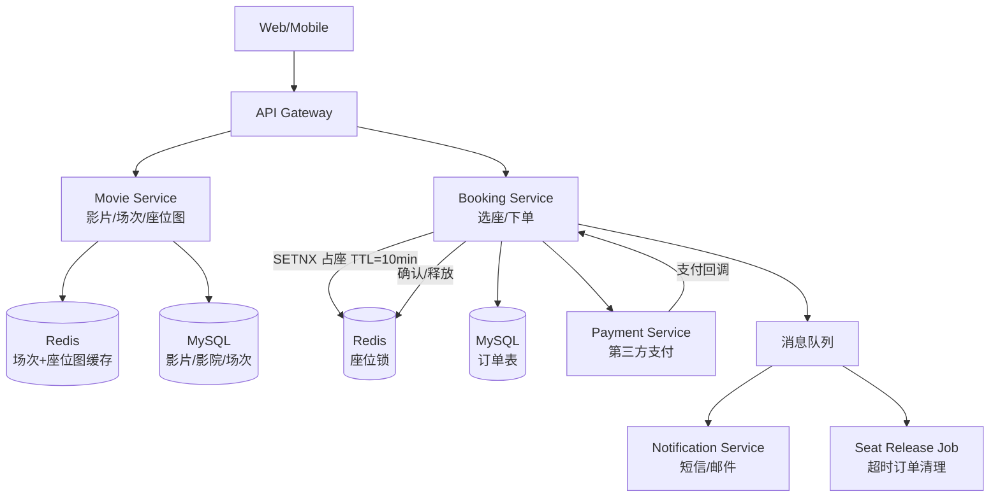
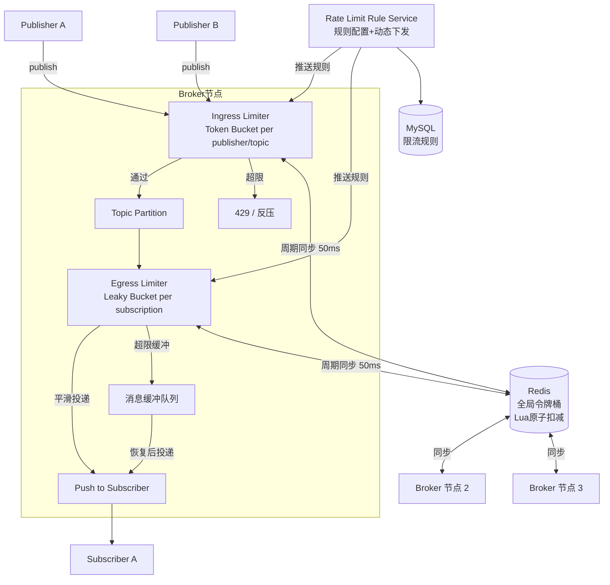

# 系统设计

## 1. 设计一个分布式消息队列（类 Kafka）

High-Level 架构图

概述用例和约束

- 核心用例：生产者发消息、消费者订阅消费、消息持久化、消息回放
- 约束：高吞吐（百万 TPS）、低延迟、消息不丢失（至少一次投递）、水平扩展
- 不需要：复杂查询、事务消息（简化版）

设计核心组件

- **Broker**：顺序写磁盘（Page Cache + sendfile 零拷贝）保证吞吐
- **Partition**：每条消息有 Offset，消费者自己维护消费位点
- **Replication**：Leader + ISR 副本，Leader 宕机从 ISR 选新 Leader
- **Producer**：批量发送 + 压缩；acks=all 保证不丢
- **Consumer Group**：同组内 Partition 1:1 分配，不同组独立消费

扩展这个设计

- 增加 Partition 数量实现水平扩展
- 多机房部署 + MirrorMaker 跨集群同步
- 消息堆积：扩 Consumer 或增加 Partition
- 延迟消息：单独时间轮 Topic + 定时投递

---

## 2. 设计一个分布式配置中心（类 Nacos/Apollo）

High-Level 架构图

概述用例和约束

- 核心用例：发布配置、客户端实时拉取/推送、灰度发布、版本回滚
- 约束：高可用、配置变更秒级生效、支持千万级客户端长连接
- 不需要：强事务、复杂权限（简化版）

设计核心组件

- **Config DB**：MySQL 存配置快照 + 变更历史，支持版本回溯
- **通知机制**：Server 间用 DB 轮询或消息队列广播变更事件
- **Long Polling**：客户端挂起请求，Server 有变更立即返回，超时再返回 304
- **本地缓存**：客户端本地文件缓存，Server 不可用时降级读本地

扩展这个设计

- 灰度：按 IP / 标签下发不同配置版本
- 多环境：Namespace 隔离 dev/staging/prod
- 高可用：Server 多副本 + DB 主从；客户端本地缓存兜底
- 审计：每次变更记录操作人 + diff，支持一键回滚

深挖问题

**Q1：DB 轮询压力暴增怎么办？消息队列广播如何保证事务性？**

DB 轮询压力：
- 单独维护轻量的 `config_change_log` 表，只写变更事件
- 每个 Server 记录上次拉取的最大 ID，只查 `WHERE id > last_id`，追加读，无全表扫
- 轮询打到只读从库，写主库不受影响（Apollo 生产方案，1s 一轮询）

消息队列事务性三种方案：

| 方案 | 原理 | 特点 |
|---|---|---|
| Transactional Outbox | DB 事务里同时写配置表 + outbox 表，relay 进程读 outbox 投 MQ | 最通用，不依赖特定 MQ |
| CDC (Debezium) | 监听 MySQL binlog，变更自动发 Kafka | 不侵入业务代码 |
| RocketMQ 事务消息 | 先发 half message，DB 写成功 commit，失败 rollback | 依赖 RocketMQ |

> 配置中心场景其实最简单：写 DB 成功就够了，MQ 投递失败重试即可——消费是幂等的，只要最终一致。

---

**Q2：Long Polling 下 Client 要和每个 Server 保持长连接吗？会频繁超时重连吗？**

- Client 只连接一个 Server（LB 分配），不需要连所有 Server
- Long Polling 是普通 HTTP 请求，超时后 Client 立刻发下一个，**复用同一条 TCP 连接**（Keep-Alive），无重新握手开销
- 30s 超时 → 立即续发，每个 Client 约 2 req/min，1 万 Client = 333 req/s，完全可接受
- 真正的问题是：Server 收到变更只能唤醒连到**自己**的那批 Client，连到其他 Server 的 Client 需要通过 Server 间通知（DB 轮询 or MQ）来触发

---

**Q3：多个 ConfigServer 是主从关系还是无主关系？Client 如何选择？**

| 方案 | 代表 | 特点 |
|---|---|---|
| 无主（Stateless） | Apollo / Nacos | Server 无状态，各自独立轮询 DB，DB 是唯一数据源，水平扩容简单 |
| 有主（Leader-based） | etcd / Consul | Raft 选主，强一致，复杂度高，适合 k8s 场景 |

配置中心推荐**无主方案**：
- 配置变更频率低，秒级最终一致够用，不需要强一致
- Server 之间根本不通信，加机器直接扩容
- Client 通过 LB 或 Meta Server 拿到 Server 列表，随机选一个；一台挂了，自动重试其他节点

---

## 3. 设计一个 RPC 框架（类 Dubbo）

High-Level 架构图

概述用例和约束

- 核心用例：服务注册/发现、远程方法调用、负载均衡、熔断降级
- 约束：调用透明（像本地调用）、低延迟、高可用
- 不需要：跨语言（Java only 简化版）

设计核心组件

- **代理层**：JDK/CGLIB 动态代理，屏蔽网络细节
- **序列化**：Hessian / Protobuf，兼顾性能和跨版本兼容
- **传输层**：Netty NIO 长连接，心跳保活
- **负载均衡**：随机、轮询、一致性哈希、最少活跃数
- **容错**：Failover（重试其他节点）/ Failfast / Fallback

扩展这个设计

- 熔断：滑动窗口统计错误率，超阈值快速失败（Hystrix 模型）
- 限流：Provider 端信号量 / 线程池隔离
- 链路追踪：透传 TraceId（MDC + Filter）
- 泛化调用：无接口 jar 也能发起调用，适合网关场景

---

## 4. 设计一个分布式限流系统

High-Level 架构图

概述用例和约束

- 核心用例：对接口/用户/IP 按 QPS 限流，超限返回 429
- 约束：低延迟（限流判断 < 1ms）、集群限流总量准确、高可用
- 不需要：复杂业务规则、按流量大小限流

设计核心组件

- **令牌桶**：Redis Hash 存 tokens + last_refill_time，Lua 原子补桶 + 取桶
- **滑动窗口**：Redis ZSet 存请求时间戳，每次 zremrangebyscore 清过期再 zcard 计数
- **规则引擎**：限流维度（接口/用户/IP）+ 阈值 + 窗口大小，存配置中心
- **降级策略**：Redis 不可用时降级为本地限流，避免全放行

扩展这个设计

- 多级限流：接口级 + 用户级 + 全局级叠加
- 预热：令牌桶冷启动时缓慢增加速率，防止突发打垮
- 流量整形：漏桶平滑输出，避免下游抖动
- 监控：限流命中率打点，阈值自动告警

---

## 5. 设计一个分布式任务调度系统（类 XXL-Job）

High-Level 架构图

概述用例和约束

- 核心用例：定时触发任务、任务分片、失败重试、执行日志查看
- 约束：调度精度秒级、任务不重复执行、执行器水平扩展
- 不需要：实时流任务、DAG 依赖（简化版）

设计核心组件

- **调度线程**：提前 5s 扫描未来一段时间到期的任务，批量加载到内存时间轮
- **分布式锁**：DB 乐观锁 / Redis SETNX，确保同一任务只被一台 Scheduler 触发
- **执行器注册**：心跳上报存活，调度中心维护在线执行器列表
- **任务分片**：将数据范围按执行器数量切片，每台执行器处理一段
- **失败重试**：记录执行日志，失败后按策略重试，超次数告警

扩展这个设计

- 调度中心高可用：多实例竞争 DB 锁，主备自动切换
- 任务优先级队列：紧急任务插队执行
- 超时控制：执行器超时强制中断 + 回调失败
- 可观测性：任务执行耗时、失败率、积压量实时监控

---

## 6. Design a Movie Theater Ticketing System

High-Level 架构图

概述用例和约束

- 核心用例：浏览影片和场次、查看座位图、选座锁定、下单支付、出票确认
- 约束：同一座位不能卖给两个人、支付与占座原子联动、热门场次开票瞬间高并发
- 不需要：内容播放、会员积分、复杂促销（简化版）

设计核心组件

**座位并发冲突**是核心难点，选座流程：

1. 用户选座 → `Redis SETNX seat:{showtime_id}:{seat_id} {user_id} EX 600`（TTL 10 分钟）
2. 锁定成功 → 创建 pending 订单写 MySQL
3. 发起支付 → 第三方回调成功 → 订单状态改 confirmed，MySQL 持久化座位状态
4. 超时未支付 → Redis TTL 到期自动释放锁，后台 Job 清理 pending 订单

**为什么不用 DB 行锁**：`SELECT FOR UPDATE` 串行化粒度粗，高并发下数据库连接池耗尽；Redis SETNX 是 O(1) 原子操作，吞吐高 10 倍以上。

**数据模型核心表**：
- `movie` / `theater` / `screen`：影片/影院/放映厅基础信息
- `showtime`：场次，关联 movie + screen + 开始时间
- `seat`：座位静态信息（行号/列号/类型）
- `order`：订单表，状态机 `pending → confirmed / cancelled`

**支付回调幂等**：订单状态机保证重复回调安全，confirmed 状态不可逆。

扩展这个设计

- **热门场次开票**：前置虚拟等候室（排队队列），匀速放行，防止瞬间流量击穿
- **读扩展**：场次/座位图缓存 Redis（TTL 30s），配置变更后主动 invalidate
- **写扩展**：按 `theater_id` 分库分表，同一影院并发天然收敛到同一分片
- **超卖兜底**：DB 层对 `(showtime_id, seat_id)` 加唯一索引，Redis 失效时最后一道防线
- **退票**：订单状态 confirmed → refunding → refunded，同步释放 Redis 座位锁并通知支付退款

---

## 7. Design a Rate Limiter for a PubSub System

High-Level 架构图

概述用例和约束

- 核心用例：限制 Publisher 发布速率（防洪）、限制 Subscriber 接收速率（防压垮消费者）、保护 Broker 自身
- 限流粒度：per publisher / per topic / per subscription 三级
- 约束：限流判决低延迟（< 1ms）、集群多节点间总量一致、规则动态生效无需重启
- 不需要：消息内容过滤、计费扣费（简化版）

设计核心组件

**两个执行点：Ingress vs Egress**

| 位置 | 执行点 | 超限行为 | 算法 |
|---|---|---|---|
| Publisher → Broker | Ingress Limiter | 拒绝 429 / 反压 | Token Bucket（允许突发） |
| Broker → Subscriber | Egress Limiter | 缓冲降速投递 | Leaky Bucket（平滑输出） |

**为什么 Ingress 用 Token Bucket、Egress 用 Leaky Bucket**：
- Publisher 有合理突发需求（批量写入），Token Bucket 允许 burst = 2× rate，不误杀
- Subscriber 处理能力固定，Leaky Bucket 以恒定速率投递，保护慢消费者

**分布式两层限流**：
- **L1 本地**：每个 Broker 内存令牌桶（Guava RateLimiter），热路径无网络开销
- **L2 全局**：Redis Lua 原子扣减，每 50ms 同步一次全局令牌到本地
- 同步公式：`local_tokens = min(burst, global_remaining / broker_count)`
- Redis 不可用时降级为纯本地限流，各节点独立限速，避免全放行

**限流规则存储与下发**：
- 规则存 MySQL：`(resource_type, resource_id, rate, burst, window)`
- 变更后通过配置中心（或 MQ）推送到各 Broker，秒级生效，无需重启

**Sliding Window Quota（日/月配额）**：
- Redis ZSet 存请求时间戳，按窗口统计用量
- 适合计费场景：超日配额降速而非拒绝，保留基础投递能力

扩展这个设计

- **优先级队列**：VIP Publisher 超限后进优先缓冲队列而非直接拒绝
- **自适应限流**：监控 Broker CPU/内存，动态收紧阈值（AIMD 算法：加性增、乘性减）
- **Subscriber 背压传播**：Subscriber 消费慢 → Egress 积压 → 反压到 Ingress → 通知 Publisher 降速
- **多租户隔离**：不同 tenant 的 topic 使用独立令牌桶，互不干扰
- **可观测性**：限流命中率、拒绝 QPS、令牌等待时间打点，触发告警

深挖问题

**Q1：Rule Service 如何把规则推送到各 Broker？**

三种方案：

| 方案 | 原理 | 特点 |
|---|---|---|
| Pull 轮询 | Broker 定期调 Rule Service API 拉规则 | 实现简单，变更最多延迟 30s |
| Long Polling | Broker 挂起请求，有变更立即返回 | 秒级生效，Rule Service 需维护连接状态 |
| MQ 广播 | 写 DB 后发消息到 control-plane topic，所有 Broker 订阅 | 解耦彻底，天然多播 |

推荐 **Pull + Push 结合**：Broker 启动时全量拉一次规则（冷启动兜底），之后增量靠 MQ 消息驱动——复用系统内部专用的 `__rate_limit_rules` topic，与业务消息隔离。

---

**Q2：Push to Subscriber 这一步到底是拉还是推？**

名字叫 Push，但主流实现是 **Pull**。

| 模型 | 代表 | 原理 | 优点 | 缺点 |
|---|---|---|---|---|
| Pull | Kafka | Subscriber 主动 fetch：`partition=0, offset=100` | 自控消费速度，天然背压；批量拉取吞吐高 | 无消息时空轮询（用 Long Polling 解决） |
| Push | Google Pub/Sub、RabbitMQ | Broker 主动 POST 到 Subscriber 的 HTTP Endpoint | 延迟低，Subscriber 无需维持长连接 | Subscriber 慢时容易被打垮，Broker 需维护重试状态 |

**对限流的影响**：
- Pull 场景：限制 Subscriber fetch 的响应速率（漏桶平滑返回）
- Push 场景：Egress Limiter 控制推送 QPS，超限消息缓冲在 Broker 侧——Push 场景下 Egress Limiter 更关键，因为 Subscriber 没有主动的背压手段，全靠 Broker 自律

